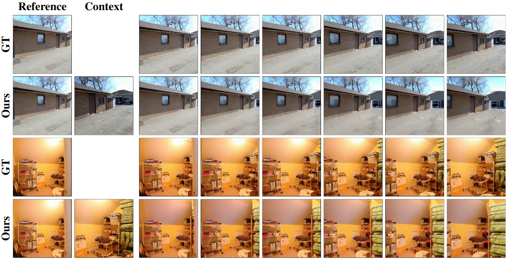

<div align="center">
<h2>CamContextI2V: Context-aware Controllable Video Generation</h2>

[**Luis Denninger**](https://scholar.google.com/citations?user=1UK2mMsAAAAJ&hl=en)<sup>1</sup> · [**Sina Mokhtarzadeh Azar**](https://scholar.google.com/citations?user=kojTGo8AAAAJ&hl=en)<sup>1</sup> · [**Jürgen Gall**](https://pages.iai.uni-bonn.de/gall_juergen/)<sup>1,2</sup> · 

<sup>1</sup>University of Bonn, Germany
<sup>2</sup>Lamarr Institute for Machine Learning and Artificial Intelligence

<a href=""></a>
<a href="misc/camcontexti2v_preprint.pdf"></a>
<a href='https://huggingface.co/LDenninger/CamContextI2V/tree/main'></a>
</div>




## 📈 Results
All our results are reported after 50K training steps using 25 DDIM steps with a guidance scale of 7.5 as reported by the baseline.
Our model performs best at a guidance scale of 3.5

| Method      | FVD (VideoGPT) | FVD (StyleGAN) | MSE     | TransErr | RotErr | CamMC  |
|-------------|----------------|----------------|---------|----------|--------|--------|
| MotionCtrl  | 78.30          | 64.47          | 3654.54 | 2.89     | 2.04   | 4.34   |
| CameraCtrl  | 71.22          | 58.05          | 3130.63 | 2.54     | 1.84   | 3.85   |
| CamI2V      | 71.01          | 57.90          | 2692.84 | 1.79     | 1.16   | 2.58   |
| **Ours**    | **53.90**      | **45.36**      | **2579.96** | **1.53** | **1.09** | **2.29** |


## 🔧 Installation
Initialize your python environment and install the [PyTorch](https://pytorch.org/) library like:
```bash
conda create -n camcontexti2v python=3.10
conda activate camcontexti2v
conda install -y pytorch==2.4.1 torchvision==0.19.1 pytorch-cuda=12.1 -c pytorch -c nvidia
conda install -y xformers -c xformers
```
Install all other requirements using:
```bash
pip install -r requirements.txt
```
### Checkpoints
Finally, download all required checkpoints and place them as follows:
| Model | Location |
|----------|----------|
| [CamContextI2V]()  | `./ckpts/256_camcontexti2v.pt`  |
| [DynamiCrafter](https://huggingface.co/Doubiiu/DynamiCrafter/blob/main/model.ckpt)  | `./ckpts/dynamicrafter/model.ckpt`  |
| [CamI2V](https://huggingface.co/MuteApo/CamI2V/blob/main/256_cami2v.pt)  | `./ckpts/256_cami2v.pt`  |
| [CameraCtrl](https://huggingface.co/MuteApo/CamI2V/blob/main/256_cameractrl.pt)  | `./ckpts/256_cameractrl.pt`  |
| [MotionCtrl](https://huggingface.co/MuteApo/CamI2V/blob/main/256_cameractrl.pt)  | `./ckpts/256_motionctrl.pt`  |
| [I3D (VideoGPT)](https://huggingface.co/spaces/LanguageBind/Open-Sora-Plan-v1.0.0/blob/810fa8c4bdb3a4c8eec9bd57375c29bde6fb46de/opensora/eval/fvd/videogpt/i3d_pretrained_400.pt)  | `.ckpts/videogpt/i3d_pretrained_400.pt`  |
| [I3D (StyleGAN)](https://huggingface.co/spaces/LanguageBind/Open-Sora-Plan-v1.0.0/blob/171d4cc747dc4d6b19f2f83584a1d6549e3ff7f0/opensora/eval/fvd/styleganv/i3d_torchscript.pt)  | `.ckpts/stylegan/i3d_torchscript.pt`  |


### Evaluation
For the evaluation pipeline you additionally need to install the following requirements.

#### FVD
Simply clone and install the following [repository](https://github.com/LDenninger/FVD):
```bash
git clone git@github.com:LDenninger/FVD.git evaluation
pip install -e evaluation/FVD
```

#### Glomap
To install [Glomap](https://github.com/colmap/glomap), please first install [Colmap](https://github.com/colmap/colmap) using the provided [instructions](https://colmap.github.io/install.html#build-from-source), then follow the installation guide in the repository.

## 📥 Data
This project uses the [RealEstate10K](https://google.github.io/realestate10k/) dataset which needs to be downloaded from YouTube. To get the meta data for the videos first obtain:
```bash
wget https://storage.cloud.google.com/realestate10k-public-files/RealEstate10K.tar.gz
```
How you obtain and unpack the dataset is up to you but we recommend following the guide as proposed [here](https://github.com/ZGCTroy/CamI2V/tree/main/datasets).

Additionally you will need the video captions generated by [CameraCtrl](https://github.com/hehao13/CameraCtrl#dataset).

The final dataset should have the following structure:
```
 ─┬─ RealEstate10K
  ├─┬─ valid_meta           # Directories holding txt files containg all meta data
  │ │─── train
  │ └─── test
  ├─┬─ video_clips          # Directories holding the video clips
  │ │─── train
  │ └─── test
  ├─── test_captions.json   # Test captions
  ├─── train_captions.json  # Train captions
  ├─── train_valid_list.txt # File containing all train video names
  └─── test_valid_list.txt  # File containg all test video names
```


## 🚀 Getting Started
This projects defines the directory and machine setup in `CamContextI2V/utils/meta.py`.
Before running anything, please adjust this file to your setup.

**Training your model:**
```bash
python CamContextI2V/01_train.py -r <run name> -c <config file> -m <machine to run on>
```
For in-detail information on the command line arguments run `python CamContextI2V/01_train.py -h`.


**Running inference:**
```bash
python CamContextI2V/02_generate_videos.py <run name>
```
For in-detail information on the command line arguments run `python CamContextI2V/02_generate_videos.py -h`.

**Evaluation:**
```bash
python CamContextI2V/03_evaluation.py -p <video path> -o <output path> --max-videos-in-mem <Images in RAM> [--fvd/--extended/--glomap]
```

**Visualization:**
To start and interactive gradio visualization, run:
```bash
python CamContextI2V/04_visualize.py
```

## 🙏 Acknowledgements
We thank the authors of [CamI2V](https://github.com/ZGCTroy/CamI2V) for their implementation of the camera pose conditioning and the authors of [DynamiCrafter](https://github.com/Doubiiu/DynamiCrafter) for the implementation of the base model.

## 📄 Citation
```
@article{denninger2025camcontexti2v,
  title={CamContextI2V: Context-aware Controllable Video Generation},
  author={Denninger, Luis and Mokhtarzadeh Azar, Sina and Gall, Juergen},
  journal={},
  year={2025}
}
```